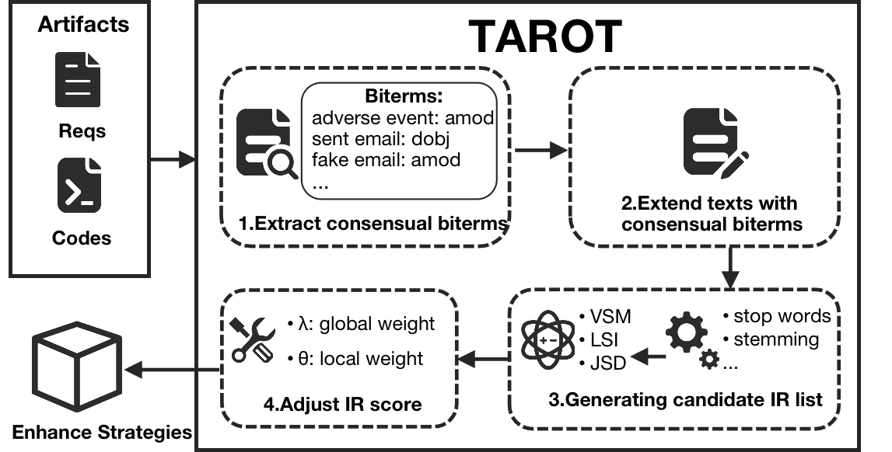

# TAROT
This the repository for our ASE'2022 paper "[Using Consensual Biterms from Text Structures of Requirements
and Code to Improve IR-Based Traceability Recovery](https://dl.acm.org/doi/10.1145/3551349.3556948)".
In this paper, TAROT is proposed to improve IR-based requirement traceability recovery through using consensual biterms extracted from requirements and code, 
which can also be combined with other enhancing strategies to promote their performance.

## Running TAROT
 * Please run `main()` in `Start.java`. 
 * You can choose different evaluated system (9 projects) and IR models (e.g., VSM, LSI, and JSD).

## Extract Consensual Biterms
* Step1: Run `experiment.preprocess.parsecode.ParseCodeAST` to extract identifier names from source code, and `experiment.preprocess.biterm.ExtractReqBiterm` to extract initial biterms from code.
* Step2: Run method`extractIssueBiterm()` and `extractUcBiterm()` in `experiment.preprocess.biterm.ExtractReqBiterm` to extract initial biterms from issue and uc respectively.
* Step3: Run `experiment.preprocess.biterm.ConsensualBiterm` to get consensual biterms both shared by requirements and source code.
